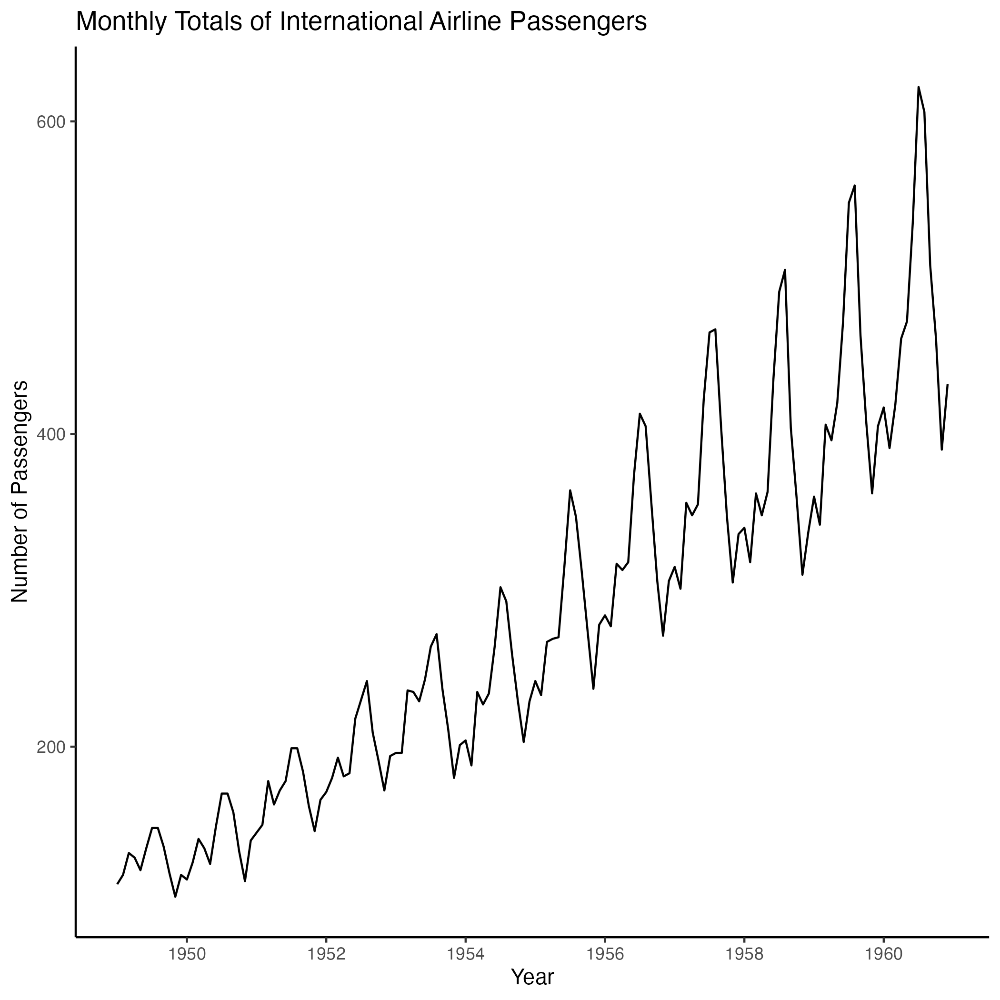
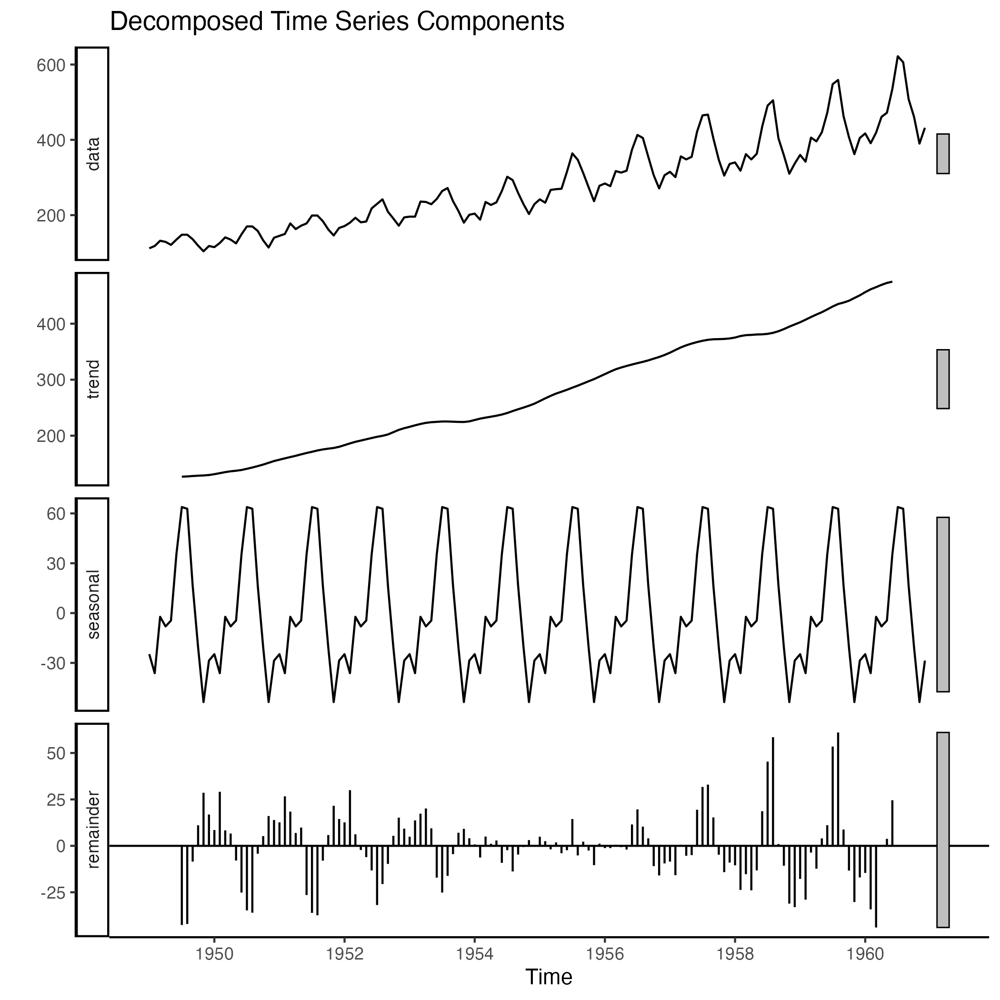
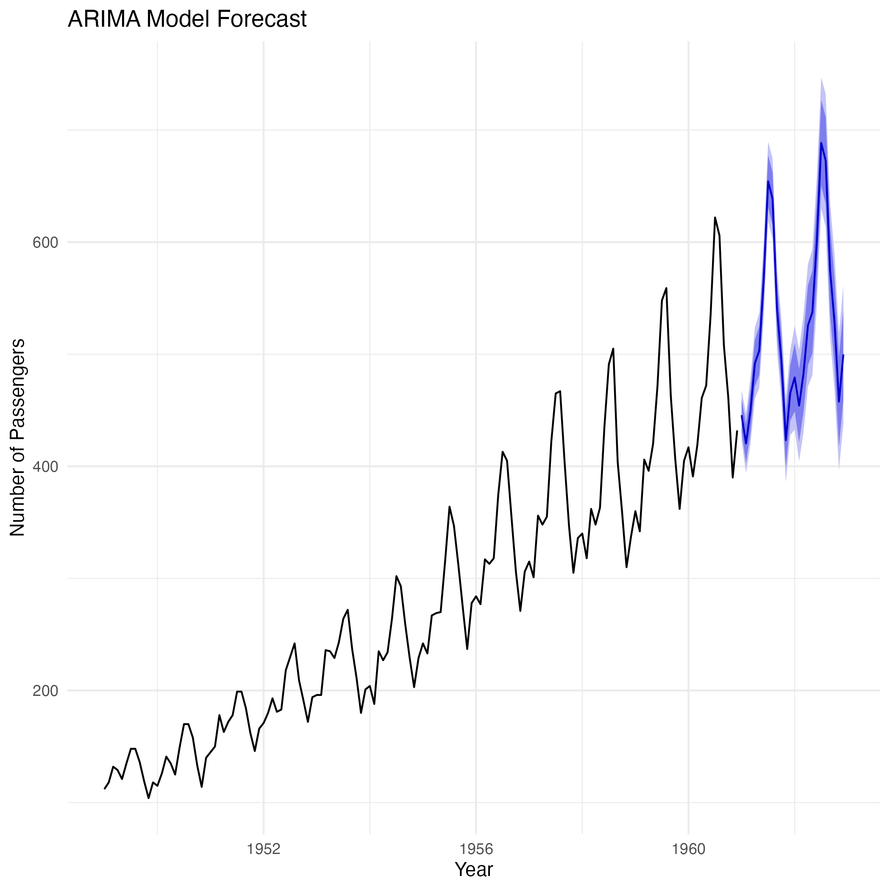
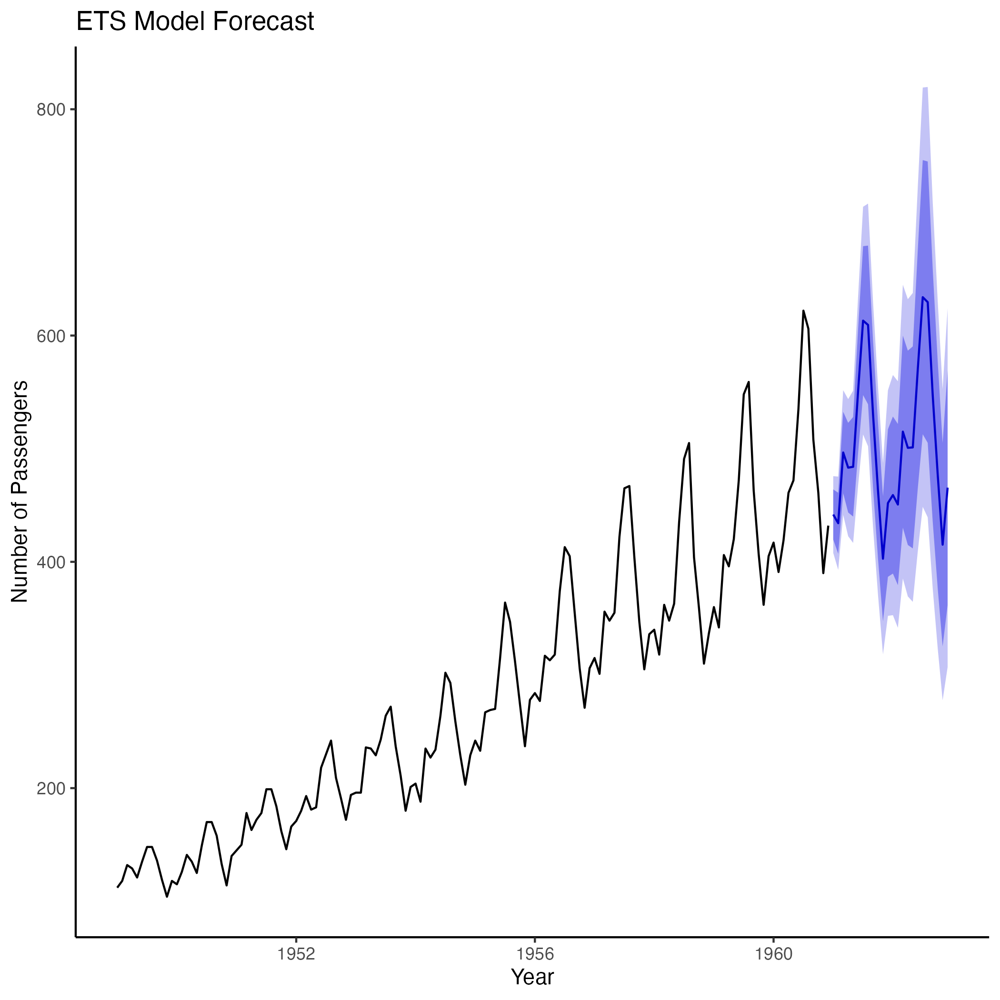

# airline-passenger-analysis_1
Time series analysis of airline passenger analysis within the specific period. 


# Time Series Analysis on Airline Passenger Data

## Project Description
This project demonstrates time series analysis techniques using the `AirPassengers` dataset. The goal is to perform time series decomposition and apply various forecasting models (ARIMA, Exponential Smoothing, Prophet) to predict future values.

## Project Goals
1. Load and Explore the Data
2. Time Series Decomposition
3. Apply and Compare Forecasting Models
4. Evaluate Model Performance
5. Develop an Interactive Shiny App for Dynamic Exploration

## Dataset
The `AirPassengers` dataset contains monthly totals of international airline passengers from 1949 to 1960.

## Methodology
### Data Loading and Exploration
- Visualize the time series data to identify trends, seasonality, and anomalies.



### Time Series Decomposition
- Decompose the time series using classical and STL decomposition methods.




### Forecasting Models
- Apply ARIMA and Exponential Smoothing (ETS) models.
- Implement Prophet model for additional forecasting.




### Model Comparison
- Evaluate model performance using accuracy metrics.
- Analyze residuals to check model adequacy.

## Findings and Insights
- Clear upward trend and seasonality in the number of passengers.
- ARIMA and ETS models provide accurate forecasts with seasonal fluctuations.
- Prophet model offers an alternative perspective with interactive components.

## Interpretation
This project uses the Exploratory Analysis, Time Series Decomposition, and Forecasting. 

Most importantly, the time series plot shows a clear upward trend and noticeable seasonality. Likewise, the decomposed components reveal a steady increase in trend and repeating seasonal pattern.The study adopts the forecasting approach. Thus, the use of ARIMA and ETS models provide forecasts with trends and seasonal fluctuations. Model performance can be evaluated using accuracy metrics.

## Usage Instructions
1. **Clone the Repository:**
   ```bash
   git clone https://github.com/kw3ku/airline-passenger-analysis_1-with_R.git
   cd your-repo-name


